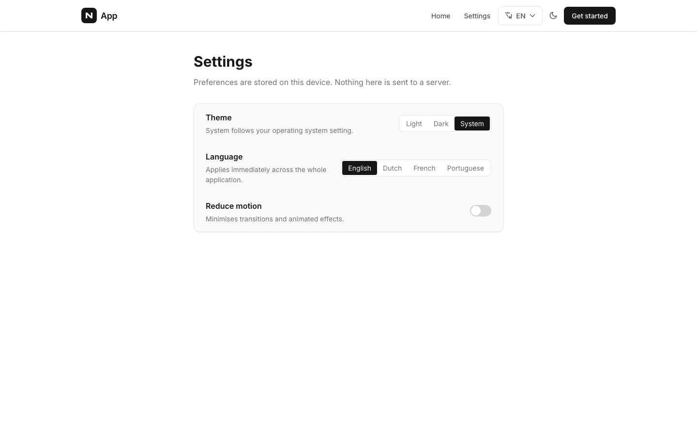
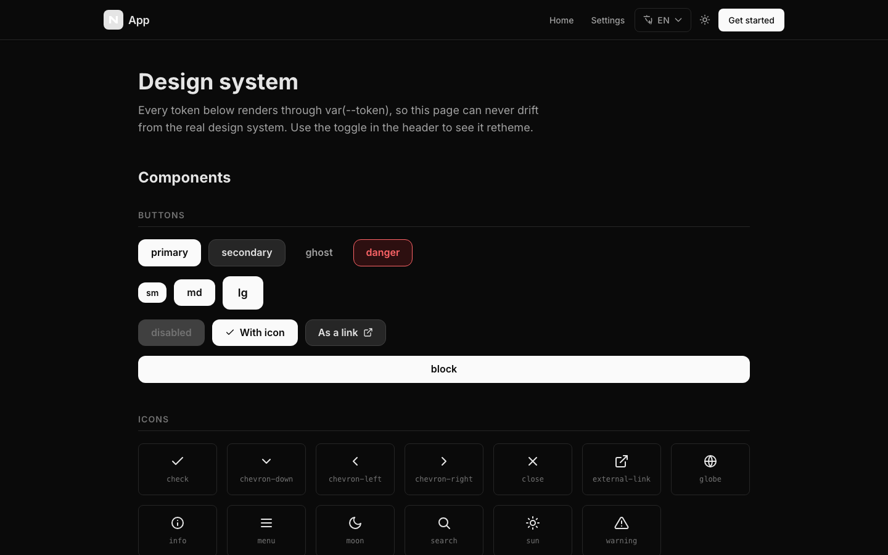
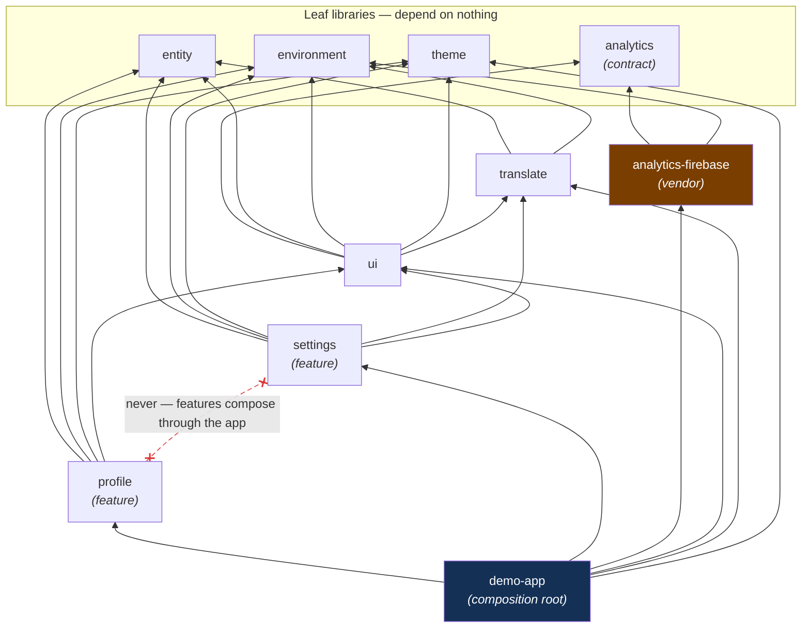
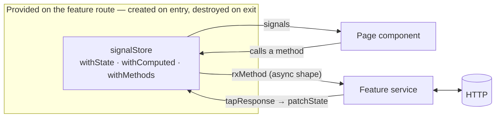
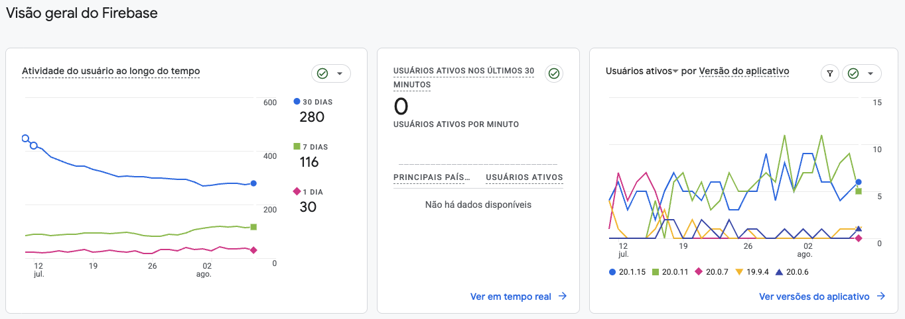

# Base NX Monorepo — Angular + NgRx Signals

[](https://github.com/myvictorlife/base-angular-monorepo/actions/workflows/ci.yml)
[](https://github.com/myvictorlife/base-angular-monorepo/actions/workflows/deploy.yml)
[](LICENSE)
[](https://angular.dev)
[](https://nx.dev)

**Clone it, `npm install`, and you have a running product skeleton** — lazy-loaded
features with SignalStore, four-language i18n, OS-synced dark mode, dependency
boundaries that fail lint, per-project coverage floors, and a CI/CD pipeline that
gives every pull request its own live preview URL. All of it before you create a
single vendor account: the week of architecture decisions that follows
`nx g @nx/angular:app`, already made, wired together and documented — including
where each one is a trade-off.

<p align="center">
  
  
</p>

**Live demo:** [base-angular-monorepo.web.app](https://base-angular-monorepo.web.app)
· [`/design`](https://base-angular-monorepo.web.app/design) renders every design
token · [`/settings`](https://base-angular-monorepo.web.app/settings) shows a
feature library end to end

## What you get out of the box

- ⚡ **Angular 22, standalone and zoneless** — no NgModules, no zone.js, OnPush everywhere, enforced by lint
- 🧠 **NgRx SignalStore per feature, provided on its route** — state is created on entry and destroyed on exit
- 🧱 **Module boundaries that bite** — features cannot import each other; an illegal import is a lint error, not a review comment
- 🌍 **i18n in four languages** — with a completeness test that fails CI the moment a key is missing from any bundle
- 🎨 **Design tokens + dark mode following the OS** — every token rendered live at [`/design`](https://base-angular-monorepo.web.app/design), so the docs cannot go stale invisibly
- 🧪 **Vitest through Angular's official builder + Playwright e2e** — with a coverage floor per project that fails the build
- 🚀 **Deploy wired end to end** — push to `main` goes live; every PR gets a preview URL and the e2e suite runs against that real deployed bundle
- 🛠️ **`nx g feature-lib`** — a complete feature (store, page, tests, i18n keys, boundary registration) in one command
- 🔐 **No credentials in git, ever** — paste a vendor config once into a git-ignored file; a pre-commit hook rejects committed API keys
- 📊 **Vendor-neutral analytics** — an `ANALYTICS` token with a no-op default; removing Firebase is deleting one lib and one line

## Quick start

```sh
git clone <your-fork> && cd base-angular-monorepo
npm install
npm start        # → http://localhost:4200
```

That is enough to run it — no Firebase project, no accounts, no `.env` editing.
Integrations stay off until you drop a config file in ([Configuration](#configuration)).

## Who this is for

- **A team starting a product** that wants the architecture arguments settled by
  lint rules instead of meetings.
- **A developer learning modern Angular** — zoneless, signals, SignalStore,
  standalone — from a codebase where every pattern is enforced, tested and
  explained in place.
- **A tech lead evaluating patterns** — the two reference features
  ([`@libs/profile`](libs/profile) async, [`@libs/settings`](libs/settings)
  synchronous) exist precisely to be read.

The demo app itself is intentionally small — profile, settings and a design-token
page. **The product here is everything around it**: the boundaries, the state
pattern, the pipeline, the guardrails.

## Contents

- [Why this and not `nx g @nx/angular:app`?](#why-this-and-not-nx-g-nxangularapp)
- [Tech stack](#tech-stack) · [Project structure](#project-structure) · [Getting started](#getting-started)
- [Configuration](#configuration) — vendor config without committing credentials
- [Architecture](#architecture) — boundaries graph, state, analytics, testing, i18n
- [Generating apps and libraries](#generating-new-apps-and-libraries) · [Code standards](#code-standards) · [npm scripts](#npm-scripts)
- [Contributing and releases](#contributing-and-releases) · [Documentation](#documentation)

---

## Why this and not `nx g @nx/angular:app`?

Fair question — the Nx generator is excellent, and everything here started from it.
What it gives you is an empty, correct workspace. What it does not give you is the
week of decisions that follow, each of which is easy to get subtly wrong and
expensive to change once a team has built on top of it.

| Decision                   | The generator                           | Here                                                                                                                                                                                                                     |
| -------------------------- | --------------------------------------- | ------------------------------------------------------------------------------------------------------------------------------------------------------------------------------------------------------------------------ |
| **Library boundaries**     | Tags exist; no rules use them           | `depConstraints` for every tag, so an illegal import is a lint error rather than a code-review comment. A leaf lib genuinely cannot reach the app.                                                                       |
| **State**                  | Nothing                                 | SignalStore per feature, provided **on the route** so it is created on entry and destroyed on exit. The global store carries router state and nothing else — a rule the boundaries actually enforce.                     |
| **i18n**                   | Nothing                                 | ngx-translate wired through one provider, language persisted, `<html lang>` synced, route titles translated. `i18n-completeness.spec.ts` fails if any key is missing from any of the four bundles, so they cannot drift. |
| **Theming**                | Nothing                                 | Design tokens in one lib, light/dark following the OS, and a `/design` page rendering every token through `var(--token)` — so the documentation cannot go stale without the page visibly breaking.                       |
| **Third-party config**     | `environment.ts` files you edit by hand | One JSON file per integration, git-ignored, compiled into typed modules. A fork never inherits your project id.                                                                                                          |
| **Analytics**              | Nothing                                 | Behind an `ANALYTICS` token with a no-op default. Delete one lib and one line to remove Firebase entirely.                                                                                                               |
| **Coverage**               | Collected, never enforced               | A per-project floor in each `test` target, set just under what the project measures today and enforced in CI — the build fails when a floor is broken.                                                                   |
| **Commits, deps, secrets** | Nothing                                 | commitlint, lint-staged, Renovate, and a pre-commit hook that rejects a committed API key.                                                                                                                               |
| **Deploy**                 | Nothing                                 | Push to `main` deploys; every pull request gets its own preview URL, and the e2e suite runs against that real deployed bundle.                                                                                           |

**Two things this template is honest about.** `@ngrx/*` sits on `22.0.0-rc.0`
because no stable NgRx 22 exists yet — the Renovate rule below moves off it the day
one ships. And unit coverage in `apps/demo-app` is intentionally low — the app
shell is exercised by the Playwright suite instead; its floor records where things
actually stand rather than a number that flatters.

**Where it is the wrong choice:** if you want one small app rather than a
workspace, if your team does not want NgRx, or if you would rather choose each
piece yourself. Nothing here is load-bearing enough to be hard to remove — but
removing five things is more work than adding them.

## Tech Stack

| Layer         | Technology                             | Version    |
| ------------- | -------------------------------------- | ---------- |
| Framework     | Angular (standalone, **zoneless**)     | 22.1.x     |
| Feature state | NgRx **SignalStore** (`@ngrx/signals`) | 22.x       |
| Global state  | NgRx Store — router state only         | 22.x       |
| i18n          | ngx-translate (signal-based)           | 18.x       |
| Monorepo      | Nx                                     | 23.x       |
| Testing       | Vitest + Spectator                     | 4.x / 22.x |
| Styling       | Tailwind CSS + SCSS                    | 4.x        |
| Language      | TypeScript                             | 6.0.x      |
| Linting       | ESLint + Prettier                      | 9.x / 3.x  |

> **No NgModules and no zone.js.** Every library exposes a provider function
> (`provideTranslation()`) or, for feature state, a `signalStore` class listed in the
> route's `providers` (`ProfileStore`). See [`docs/best-practices.md`](docs/best-practices.md).

> ⚠️ **`@ngrx/*` is currently on `22.0.0-rc.0`.** NgRx 22 has no stable release yet and
> Angular 22 requires it (NgRx 21 peers on `@angular/core@^21`). No source changes are
> expected when it lands: the `ngrx` rule in [`renovate.json`](renovate.json) accepts
> prereleases, so the stable 22.x arrives as an ordinary upgrade PR the day it is
> published.

---

## Project Structure

The short version: `apps/demo-app` composes, `libs/` holds two reference features
(`profile`, `settings`) plus shared `ui`, `theme`, `translation`, `entity`,
`environment` and the analytics pair, and `tools/` carries the config generator,
the secrets guard and the `feature-lib` generator.

<details>
<summary><b>Full annotated tree</b> (click to expand)</summary>

```
base-angular-monorepo/
│
├── apps/                                   # Application entry points
│   └── demo-app/                          # Main Angular application
│       ├── src/
│       │   ├── app/
│       │   │   ├── core/                   # Core services and global state
│       │   │   │   ├── +state/             # NgRx router state
│       │   │   │   │   └── index.ts
│       │   │   │   └── services/router/
│       │   │   │       └── router-serializer.ts
│       │   │   ├── pages/                  # Route-level page components
│       │   │   │   ├── home/
│       │   │   │   ├── design/             # Renders every design token
│       │   │   │   ├── not-found/
│       │   │   │   └── pages.routes.ts
│       │   │   ├── app.config.ts           # Application providers setup
│       │   │   ├── app.routes.ts           # Root routing configuration
│       │   │   └── app.ts                  # Root component
│       │   ├── assets/i18n/                # en · nl · fr · pt translation bundles
│       │   ├── main.ts                     # Bootstrap entry point
│       │   ├── fonts.css                   # Self-hosted Inter @font-face rules
│       │   ├── index.html
│       │   └── styles.scss                 # Global styles
│       ├── e2e/                            # Playwright specs (navigation, settings, a11y)
│       ├── public/                         # Copied verbatim (favicon, fonts/)
│       ├── project.json                    # Nx targets, incl. this project's coverage floor
│       ├── playwright.config.mts           # BASE_URL switches local ↔ deployed
│       └── eslint.config.mjs
│
├── libs/                                   # Shared libraries
│   │
│   ├── environment/                        # Environment configuration
│   │   └── src/lib/
│   │       ├── environment.model.ts        # Environment interface (prevents drift)
│   │       ├── environment.ts              # Production config
│   │       ├── environment.development.ts  # Development config
│   │       ├── environment.local.ts        # Local config
│   │       ├── generated/                  # Generated from config/*.json — git-ignored
│   │       └── api.paths.ts                # API path constants
│   │
│   ├── profile/                            # Feature library — async shape (HTTP + rxMethod)
│   │   └── src/lib/
│   │       ├── +state/
│   │       │   └── profile.store.ts        # signalStore — state, computed, methods
│   │       ├── molecules/                  # Compound components (Atomic Design)
│   │       │   └── user-info/
│   │       ├── pages/
│   │       │   ├── profile/
│   │       │   └── user.routes.ts          # Provides ProfileStore on the route
│   │       └── services/profile/
│   │           └── profile.service.ts
│   │
│   ├── settings/                           # Feature library — sync shape (local persistence)
│   │   └── src/lib/
│   │       ├── +state/
│   │       │   └── settings.store.ts       # No HTTP; forwards to theme/i18n services
│   │       ├── molecules/setting-row/
│   │       └── pages/
│   │           ├── settings/
│   │           └── settings.routes.ts
│   │
│   ├── theme/                              # Design tokens + ThemeService (light/dark)
│   │   └── src/
│   │       ├── lib/
│   │       │   └── theme.service.ts        # Theme signal, OS preference, persistence
│   │       └── styles/
│   │           ├── _tokens.scss            # Design tokens (colors, spacing, typography)
│   │           ├── _themes.scss            # Light/dark theme definitions
│   │           ├── _breakpoints.scss       # Responsive breakpoints
│   │           └── _index.scss             # Public style entry point
│   │
│   └── shared/                             # Cross-cutting shared libraries
│       │
│       ├── entity/                         # Data models and interfaces
│       │   └── src/lib/entity/
│       │       ├── error/error.model.ts
│       │       ├── language/language.enum.ts
│       │       ├── router-state/router-state-url.model.ts
│       │       └── user/user.model.ts
│       │
│       ├── translation/                    # i18n setup and language switching
│       │   └── src/lib/
│       │       ├── core/
│       │       │   ├── translation.providers.ts    # provideTranslation()
│       │       │   ├── language-storage.ts         # localStorage persistence
│       │       │   ├── document-language.ts        # keeps <html lang> in sync
│       │       │   ├── translated-title.strategy.ts # translated <title> per route
│       │       │   └── update-language.service.ts
│       │       └── pages/update-language/
│       │
│       ├── analytics/                      # ANALYTICS token + Analytics interface + NoopAnalytics
│       │   └── src/lib/analytics.ts        # Vendor-neutral. Depends on nothing.
│       │
│       ├── analytics-firebase/             # The only project that names Firebase
│       │   └── src/lib/
│       │       ├── firebase-analytics.ts           # Dynamic import, never static
│       │       └── firebase-analytics.providers.ts # provideFirebaseAnalytics()
│       │
│       └── ui/                             # Reusable UI + app-wide cross-cutting
│           └── src/lib/
│               ├── atoms/                  # button · card · alert · badge · icon · spinner · theme-toggle
│               ├── organisms/header/
│               └── core/
│                   ├── global-error-handler.ts     # reports through ANALYTICS
│                   └── http-error.interceptor.ts
│
├── docs/                                   # Project documentation
│   ├── best-practices.md                   # Angular coding standards and patterns
│   ├── workspace-generators.md             # Nx generator commands reference
│   └── skills/                             # Development guides for Claude Code
│
├── config/                                 # One JSON per integration — paste the vendor object
│   ├── README.md                           # Setup + how to add another integration
│   └── firebase.example.json               # Copy to firebase.json (git-ignored)
│
├── tools/
│   ├── generate-config.mjs                 # config/*.json → typed modules + .firebaserc
│   ├── check-no-secrets.mjs                # Pre-commit guard against committed credentials
│   └── workspace-plugin/                   # nx g feature-lib — complete feature libs in one step
│
├── hosting/                                # Firebase Hosting config + deploy walkthrough
├── .husky/                                 # pre-commit (lint-staged + secrets) · commit-msg
├── .env.example                            # Scalars and CI overrides
├── .github/
│   ├── workflows/ci.yml                    # lint · test + coverage · build · e2e
│   ├── workflows/deploy.yml                # main → live channel
│   ├── workflows/preview.yml               # PR → preview channel, then e2e against it
│   ├── ISSUE_TEMPLATE/
│   └── PULL_REQUEST_TEMPLATE.md
├── renovate.json                           # Grouped upgrades; tracks NgRx off its prerelease
├── commitlint.config.mjs                   # Conventional Commits
├── .lintstagedrc.mjs                       # Staged-file lint + format
├── nx.json                                 # Nx workspace configuration
├── tsconfig.base.json                      # Shared TypeScript paths and config
├── eslint.base.config.mjs                  # Shared ESLint rules + depConstraints
├── CONTRIBUTING.md · CODE_OF_CONDUCT.md · CHANGELOG.md · LICENSE
├── package.json
└── README.md
```

</details>

---

## Getting Started

### Prerequisites

- **Node.js `^22.22.3` or `^24.15.0` or `>=26`** — required by Angular 22
- npm >= 10

### Install dependencies

```sh
npm install
```

### Run the application

```sh
npx nx serve demo-app                        # development
npx nx serve demo-app --configuration=local  # local environment
```

### Run tests

```sh
npx nx test demo-app                  # single project
npx nx run-many --target=test --all    # all projects
```

### Lint

```sh
npx nx run-many --target=lint --all
```

### Build

```sh
npx nx build demo-app --configuration=production
```

Three configurations exist — `production`, `development` and `local` — each swapping
`libs/environment/src/lib/environment.ts` for its variant.

---

## Configuration

Third-party setup lives in [`config/`](config/README.md) — **one JSON file per
integration, holding the object that vendor's console gives you**. Nothing else to fill
in, and nothing tracked by git.

**All of it is optional.** With no config file the app builds and runs with the
integration off (`firebaseEnabled: false`, analytics no-ops), so a fresh clone works
before you own a single vendor account.

Firebase, today's only integration:

```sh
cp config/firebase.example.json config/firebase.json
```

Firebase Console → Project settings → General → Your apps → SDK setup and configuration
→ **Config** gives you an object. Paste it in, braces and all:

```json
{
  "apiKey": "AIzaSy...",
  "authDomain": "my-app.firebaseapp.com",
  "projectId": "my-app",
  "storageBucket": "my-app.firebasestorage.app",
  "messagingSenderId": "123456789012",
  "appId": "1:123456789012:web:abc123",
  "measurementId": "G-ABCDEF1234"
}
```

The console shows JavaScript, not JSON — unquoted keys, single quotes, a trailing comma.
Paste it raw anyway; the reader normalises all of it.

<details>
<summary><b>How it works under the hood, <code>.env</code> scalars, and adding more integrations</b></summary>

`tools/generate-config.mjs` compiles that into **git-ignored** files, on `npm install`
and before every Nx build, serve and test:

| Generated file                                          | Used for                                               |
| ------------------------------------------------------- | ------------------------------------------------------ |
| `libs/environment/src/lib/generated/firebase.config.ts` | what the app compiles against                          |
| `hosting/.firebaserc`                                   | the project `npm run build:deploy:firebase` deploys to |

So one paste configures both the app and the deploy — the `projectId` in the object is
what picks the deploy target. `npm run config:generate` regenerates on demand.

`.env` is still there for **scalars**: per-machine settings and CI overrides
(`FIREBASE_API_KEY`, `FIREBASE_PROJECT_ID`, …). Real environment variables win over the
file, so GitHub Actions secrets need no config file at all. See
[`.env.example`](.env.example).

Why keep any of it out of the repo, given a Firebase web config is public by design and
ships in the client bundle? Because this is a public template: keeping credentials in
untracked files means a clone never reports analytics into someone else's project, and
you edit one file instead of three. Genuine secrets — service accounts, private API
keys — belong in a backend, not in any file the frontend build reads.

**Adding another integration** is three steps — an interface in `environment.model.ts`,
an entry in `tools/generate-config.mjs`, an example file in `config/`. Recipe in
[`config/README.md`](config/README.md).

**Starting from an empty Firebase account?**
[`hosting/README.md`](hosting/README.md) walks through it with screenshots — creating
the project, enabling Analytics and Hosting, registering the web app, and deploying.

</details>

Details: [`config/README.md`](config/README.md) ·
[`libs/environment/README.md`](libs/environment/README.md) ·
[`.claude/skills/firebase-deploy/SKILL.md`](.claude/skills/firebase-deploy/SKILL.md)

---

## Generating New Apps and Libraries

### New application

```sh
npx nx g @nx/angular:app apps/<app-name>
```

### New library

Tags **must** use the `scope:` prefix — `eslint.base.config.mjs` matches on it, and a
library tagged otherwise silently escapes every dependency rule.

```sh
# Feature library — the workspace generator does the whole job: files, tag in
# depConstraints, path alias, Vitest test target and seeded i18n keys.
npx nx g @app/workspace-plugin:feature-lib <feature-name>                 # local state
npx nx g @app/workspace-plugin:feature-lib <feature-name> --shape=async   # HTTP + rxMethod

# Non-feature libraries use the stock Nx generator:
npx nx g @nx/angular:library libs/shared/ui --tags=scope:ui-lib --style=scss
npx nx g @nx/angular:library libs/shared/entity --tags=scope:entity-lib --style=scss
```

> After creating a library **manually**, add its tag to `depConstraints` in
> `eslint.base.config.mjs`. A tag with no entry there is **unconstrained**. See
> [`.claude/skills/module-boundaries/SKILL.md`](.claude/skills/module-boundaries/SKILL.md).
> The feature-lib generator does this registration for you.

---

## Architecture

### Library Tags and Dependency Rules

Every arrow below is an allowance the linter enforces; anything not allowed fails
the build (the table underneath is the exact allow-list). The red dashed line is
the rule that keeps the workspace deletable: features never see each other.



Defined in `eslint.base.config.mjs` — the file every project's `eslint.config.mjs`
extends. (The root `eslint.config.mjs` applies to workspace-level files only; rules
placed there would never run for a project.)

| Tag                            | May depend on                                    | Purpose                             |
| ------------------------------ | ------------------------------------------------ | ----------------------------------- |
| `scope:entity-lib`             | _nothing_                                        | Data models and interfaces          |
| `scope:environment-lib`        | _nothing_                                        | Environment configuration           |
| `scope:theme-lib`              | _nothing_                                        | Design tokens and `ThemeService`    |
| `scope:analytics-lib`          | _nothing_                                        | The `ANALYTICS` contract            |
| `scope:analytics-firebase-lib` | analytics, environment                           | The Firebase implementation         |
| `scope:translate`              | entity, environment                              | i18n setup, language switching      |
| `scope:profile`                | entity, environment, theme, ui                   | Profile feature                     |
| `scope:settings`               | entity, environment, theme, translate, ui        | Settings feature                    |
| `scope:ui-lib`                 | analytics, entity, environment, theme, translate | Presentational + cross-cutting UI   |
| `scope:demo-app`               | all of the above                                 | The application composes everything |

Two rules worth naming, because they are what the table is _for_:

- **Features cannot see each other.** `scope:profile` and `scope:settings` have no
  entry for one another, so a shortcut import between them fails lint. Features
  compose through the app.
- **Only the app may reach `scope:analytics-firebase-lib`.** Picking a vendor is a
  composition decision, so it happens once, in `app.config.ts`. Libraries depend on
  `scope:analytics-lib` — the contract — and never learn which implementation is
  behind it.

### Atomic Design (component organization)

```
atoms/       → Basic reusable elements — libs/shared/ui/src/lib/atoms/
molecules/   → Combinations of atoms — profile/user-info, settings/setting-row
organisms/   → Complete structures — libs/shared/ui/src/lib/organisms/header/
pages/       → Route-level components — <feature>/src/lib/pages/
```

Atoms and organisms live in `@libs/ui` because they are shared. Molecules usually do
not: a `user-info` card belongs to the profile feature, and hoisting it into shared
UI before a second consumer exists is how a shared lib becomes a junk drawer.

### State Pattern

No actions, no reducers, no selector files — a feature's state is a
`signalStore` the component talks to directly, and the async path goes through
`rxMethod` + `tapResponse`:



**Feature state is a `signalStore`**, provided on its route:

```
libs/<feature>/src/lib/
├── +state/
│   └── <feature>.store.ts     # withState · withComputed · withMethods
└── pages/
    └── <feature>.routes.ts    # providers: [<Feature>Store, <Feature>Service]
```

The global NgRx Store carries **router state and nothing else**. Features do not add
slices to it. See [`.claude/skills/ngrx-state/SKILL.md`](.claude/skills/ngrx-state/SKILL.md).

Two feature libraries ship as reference, on purpose showing different shapes:

|                 | `@libs/profile`                                 | `@libs/settings`                                                                                  |
| --------------- | ----------------------------------------------- | ------------------------------------------------------------------------------------------------- |
| Data            | HTTP via a service                              | none — local and synchronous                                                                      |
| Store           | `rxMethod` + `tapResponse`, loading/error state | plain methods, `withHooks` on entry                                                               |
| Owns its state? | yes                                             | no — forwards to `ThemeService` / `UpdateLanguageService` and exposes them through `withComputed` |

That last row is the one people get wrong. Theme and language already live in
services as signals; copying them into `withState` creates a second source of truth
that goes stale the moment the header changes the language.

### Analytics

Nothing outside `@libs/analytics-firebase` knows Firebase exists.

```ts
// Anywhere: inject the contract.
private readonly analytics = inject(ANALYTICS);

// app.config.ts: choose an implementation, once.
provideFirebaseAnalytics(),
```

Without that provider `ANALYTICS` resolves to `NoopAnalytics`, so call sites need no
`if (analytics)` guard and no vendor SDK is bundled. Removing Firebase entirely is
deleting one lib, one line and one dependency.

With a config file in place, page views and events land in the Firebase console:

<p align="center">
  
</p>

### Testing

| Layer      | Tool               | Covers                                                             |
| ---------- | ------------------ | ------------------------------------------------------------------ |
| Unit       | Vitest + Spectator | Stores, services, components                                       |
| End-to-end | Playwright         | Routing, lazy chunks, persistence, `<html lang>`, accessible names |

Unit tests run through Angular's official `@angular/build:unit-test` builder with
Vitest as the runner. Each project sets its own coverage floor in the `test` target
of its `project.json`, just under what it measures today. One caveat to keep in
mind: coverage is measured from the compiled test bundle, so a file no spec (or
route) imports is invisible to the report rather than dragging the number down.

The e2e suite runs twice: against `nx serve` in CI, and against the deployed
preview channel on every pull request via `BASE_URL`. The second run is the only one
that exercises production optimisation, hashed assets, hosting rewrites and the
security headers.

### Internationalisation

Four bundles live in `apps/demo-app/src/assets/i18n/` — `en`, `nl`, `fr`, `pt`.
`provideTranslation()` wires the loader, restores the language from `localStorage`,
keeps `<html lang>` in sync and translates each route's `<title>`.

Adding a language means adding it to the `Language` enum and dropping in the JSON
bundle — `i18n-completeness.spec.ts` fails until every key is present in every
language, so bundles cannot drift.

---

## Code Standards

This project enforces **modern Angular** patterns. See [`docs/best-practices.md`](docs/best-practices.md) for the full guide.

Key rules:

- Use `@if` / `@for` — never `*ngIf` / `*ngFor`
- Use `input()` / `output()` functions — never `@Input` / `@Output` decorators
- Standalone components only — **no NgModules**, use provider functions
- `ChangeDetectionStrategy.OnPush` on every component (enforced by lint)
- Import only what a template uses (`TranslatePipe`, `RouterLink`) — not `CommonModule`
- Prefer signals over RxJS subscriptions in components

---

## npm Scripts

| Command                              | Description                                                                                           |
| ------------------------------------ | ----------------------------------------------------------------------------------------------------- |
| `npm start`                          | Serve the application                                                                                 |
| `npm test`                           | Run tests                                                                                             |
| `npm run test:all`                   | Run all project tests                                                                                 |
| `npm run lint:all`                   | Lint all projects                                                                                     |
| `npm run config:generate`            | Regenerate typed config modules from `config/*.json` (runs automatically on install/build/serve/test) |
| `npm run build:deploy:firebase`      | Production build + deploy to Firebase Hosting                                                         |
| `npx nx e2e demo-app`                | Playwright suite against a locally served build                                                       |
| `BASE_URL=<url> npx nx e2e demo-app` | The same suite against a deployed URL                                                                 |

---

## Contributing and releases

- [`CONTRIBUTING.md`](CONTRIBUTING.md) — what belongs in a template, setup, the rules
  the linter enforces, commit format
- [`CHANGELOG.md`](CHANGELOG.md) — Keep a Changelog; "breaking" means breaking for a
  fork pulling updates
- [`CODE_OF_CONDUCT.md`](CODE_OF_CONDUCT.md) — Contributor Covenant 2.1
- [`LICENSE`](LICENSE) — MIT. Fork it, ship it, no attribution required.

Commits follow [Conventional Commits](https://www.conventionalcommits.org), enforced
by commitlint. `husky` runs lint-staged and a credential scan before each commit.
Dependencies are kept current by Renovate, grouped so Angular and Nx upgrade as sets
rather than as conflicting individual PRs.

---

## Documentation

- [`docs/best-practices.md`](docs/best-practices.md) — Angular and project coding standards
- [`docs/workspace-generators.md`](docs/workspace-generators.md) — Nx generator reference
- [`config/README.md`](config/README.md) — integration config: where credentials go, how to add one
- [`hosting/README.md`](hosting/README.md) — Firebase setup and deploy, screenshot by screenshot

### Agent instructions

[`AGENTS.md`](AGENTS.md) is the entry point for AI coding agents — architecture
rules, the non-negotiables lint enforces, verification commands, and the known gaps
an agent should not claim are solved. [`CLAUDE.md`](CLAUDE.md) imports it, so Claude
Code, Codex, Cursor and Copilot all read one file rather than a copy each.

### Skills

The step-by-step guides are packaged as [Claude Code skills](https://code.claude.com/docs/en/skills)
in `.claude/skills/<name>/SKILL.md`. Each carries `name` and `description`
frontmatter, so an agent loads the relevant one **on demand** — writing a component
pulls in `angular-component`, a boundary lint error pulls in `module-boundaries` —
instead of holding all 1,700 lines in context or, more likely, never finding them.

They are ordinary markdown and read fine on their own.

| Skill                                                                                      | Description                                                                                                       |
| ------------------------------------------------------------------------------------------ | ----------------------------------------------------------------------------------------------------------------- |
| [`.claude/skills/feature-lib/SKILL.md`](.claude/skills/feature-lib/SKILL.md)               | Creating a complete feature library (`libs/profile` for the async shape, `libs/settings` for the synchronous one) |
| [`.claude/skills/lazy-loading/SKILL.md`](.claude/skills/lazy-loading/SKILL.md)             | Lazy loading rules — what to export, how to wire routes, common mistakes                                          |
| [`.claude/skills/ngrx-state/SKILL.md`](.claude/skills/ngrx-state/SKILL.md)                 | SignalStore pattern — state, computed, methods, and migrating off the classic store                               |
| [`.claude/skills/angular-component/SKILL.md`](.claude/skills/angular-component/SKILL.md)   | Modern Angular component patterns — signals, input/output, control flow                                           |
| [`.claude/skills/unit-testing/SKILL.md`](.claude/skills/unit-testing/SKILL.md)             | Unit testing with Vitest and Spectator                                                                            |
| [`.claude/skills/module-boundaries/SKILL.md`](.claude/skills/module-boundaries/SKILL.md)   | Nx tags, ESLint boundary rules, registration steps                                                                |
| [`.claude/skills/firebase-analytics/SKILL.md`](.claude/skills/firebase-analytics/SKILL.md) | Analytics setup and event logging                                                                                 |
| [`.claude/skills/firebase-deploy/SKILL.md`](.claude/skills/firebase-deploy/SKILL.md)       | Build and deploy to Firebase Hosting                                                                              |
