# Deploying to Firebase Hosting — step by step

From an empty Firebase account to a public URL. Follow it once, top to bottom, and
`npm run build:deploy:firebase` publishes the app.

> The screenshots are from the Firebase Console in **pt-BR**; the English label is given
> alongside each one, so the guide works whichever language your console is in.

**Two things this template already did for you:**

- `hosting/firebase.json` is written and tuned for an Angular SPA — **never run
  `firebase init`**, it overwrites this file.
- `hosting/.firebaserc` is _generated_ from your `.env`, so there is no project id to
  fill in by hand.

---

## 1. Create the Firebase project

[console.firebase.google.com](https://console.firebase.google.com) → **Add project**.

Name it. The console derives a globally unique **project id** underneath the field
(`fir-app-e7036` here) — that id, not the display name, is what the app and the deploy
use later.

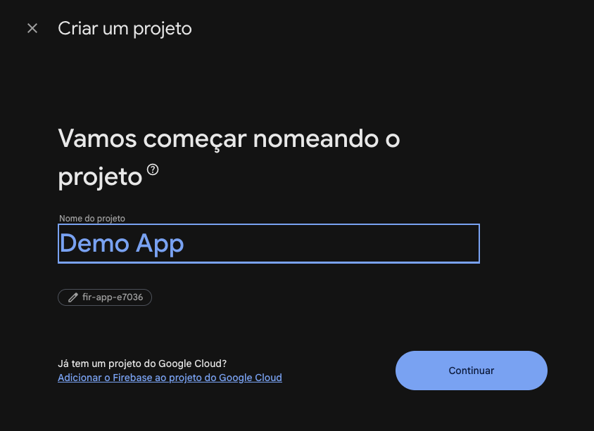

**Gemini in Firebase** is optional and unrelated to this template. Leave it off or on.

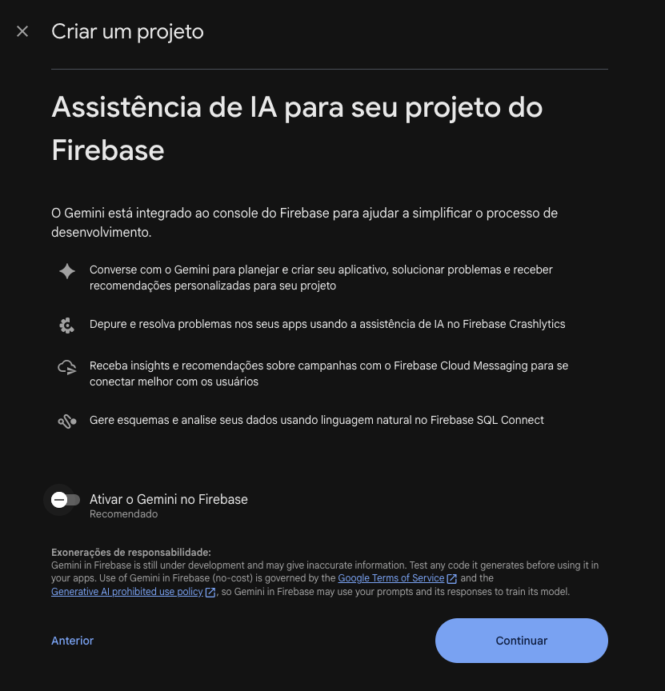

**Keep Google Analytics enabled** (_Ativar o Google Analytics neste projeto_). This is
the one choice on this screen that matters here: it is what later gives your web app a
`measurementId`, and without it `AnalyticsService` has nothing to report to.


Pick or create an Analytics account, choose a location, accept the terms, and
**Create project**.

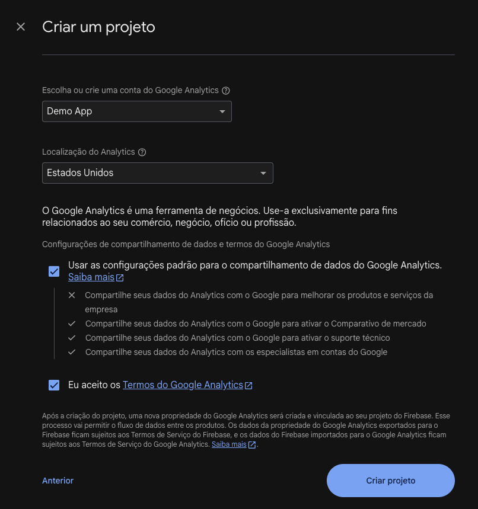


---

## 2. Enable Hosting

Left sidebar → **Hosting** → **Get started** (_Vamos começar_).

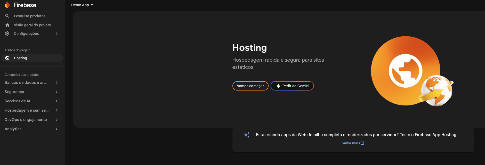

The console now walks through three steps. **Only the first one applies to you** — the
other two are for projects that have no build tooling yet.

**Step 1 — install the Firebase CLI.** Do run this, globally, once per machine:

```sh
npm install -g firebase-tools
```

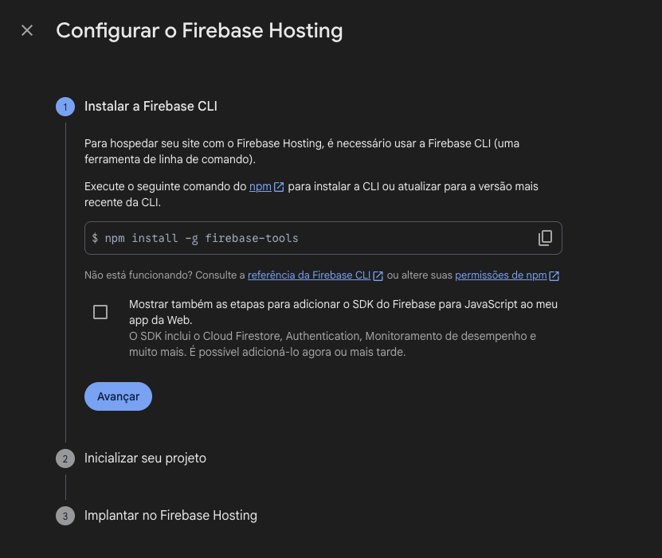

**Step 2 — "Initialize your project".** Run `firebase login` if you have never
authenticated on this machine. **Skip `firebase init`**: it would ask which folder to
publish and rewrite `hosting/firebase.json`, undoing the SPA rewrites and cache headers
this template ships.

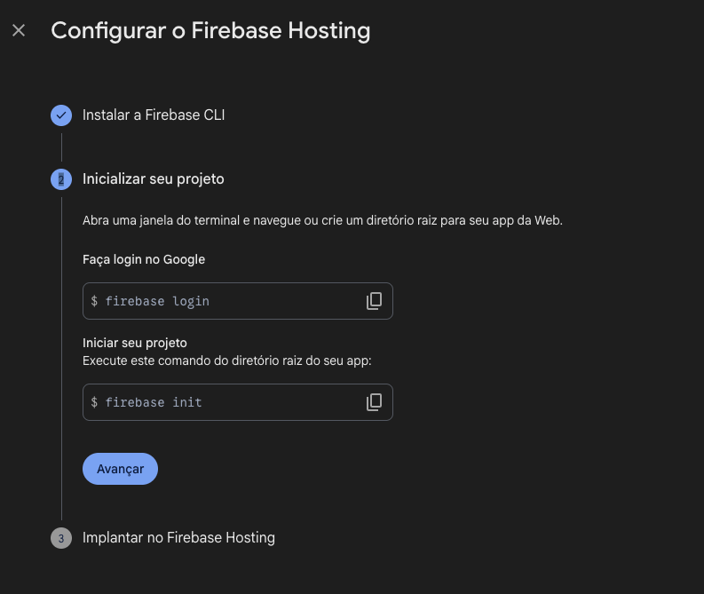

**Step 3 — "Deploy".** Skip the bare `firebase deploy` too — `npm run
build:deploy:firebase` builds, copies `dist/` into `hosting/` and deploys from the right
directory. Note the site URL shown here (`<project-id>.web.app`); that is where the app
lands.

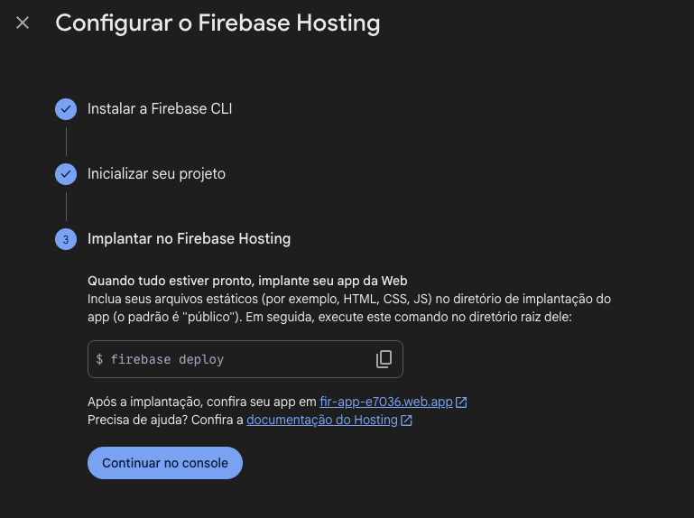

Click **Continue to console**.

---

## 3. Register a web app and copy its config

The project exists, but no _app_ is registered inside it yet — that is what produces the
config object. Sidebar → **Settings** (_Configurações_) → **Project settings**
(_Geral_).

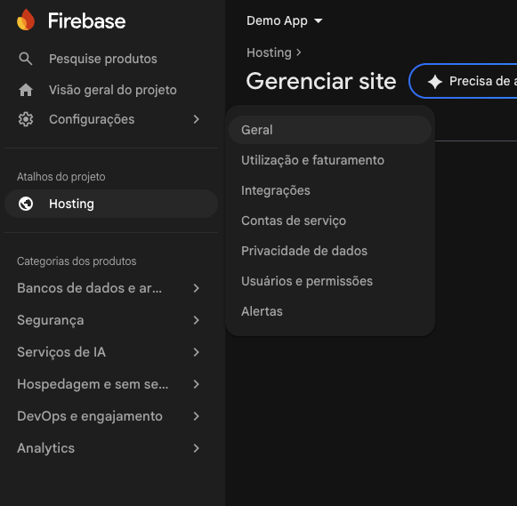

Scroll to **Your apps** (_Seus aplicativos_) and pick the **Web** platform — the `</>`
icon.

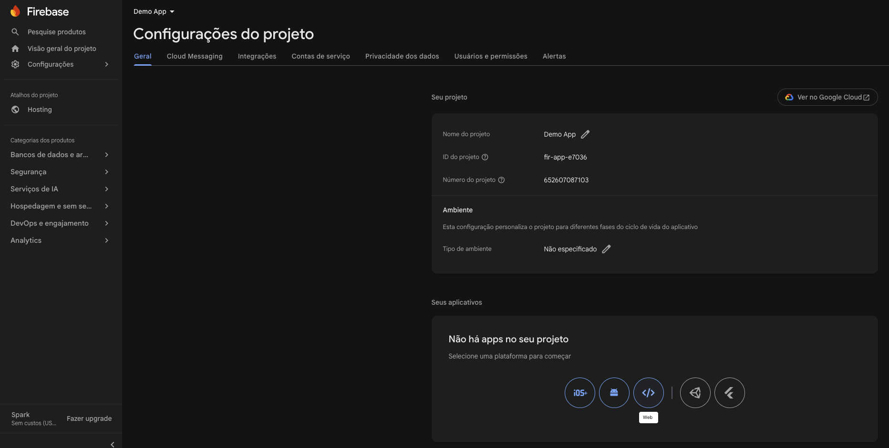

Give it a nickname. **Leave "Also set up Firebase Hosting" unchecked** — you already did
that in step 2. Then **Register app**.

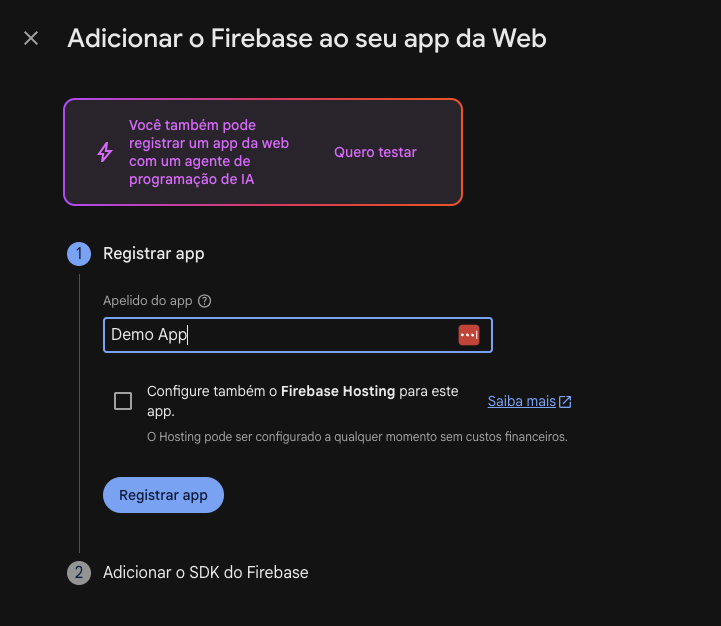

The next panel — **Add Firebase SDK** — is the one that matters: it shows a
`firebaseConfig` object. Ignore the surrounding `npm install firebase` instructions
(this repo already depends on `firebase`) and **copy the object itself**:

```js
const firebaseConfig = {
  apiKey: 'AIzaSy...',
  authDomain: 'fir-app-e7036.firebaseapp.com',
  projectId: 'fir-app-e7036',
  storageBucket: 'fir-app-e7036.firebasestorage.app',
  messagingSenderId: '652607087103',
  appId: '1:652607087103:web:abc123',
  measurementId: 'G-ABCDEF1234',
};
```

> No `measurementId`? Google Analytics was not enabled for the project. Enable it under
> **Analytics** in the sidebar, then re-open this panel.

Now create your config file and paste the object into it — **only the object, braces
included**:

```sh
cp config/firebase.example.json config/firebase.json
```

```json
{
  "apiKey": "AIzaSy...",
  "authDomain": "fir-app-e7036.firebaseapp.com",
  "projectId": "fir-app-e7036",
  "storageBucket": "fir-app-e7036.firebasestorage.app",
  "messagingSenderId": "652607087103",
  "appId": "1:652607087103:web:abc123",
  "measurementId": "G-ABCDEF1234"
}
```

The console hands you JavaScript, not JSON. Paste it raw anyway — unquoted keys, single
quotes, trailing commas, `//` comments and a leading `const firebaseConfig =` all
survive. Quoting the keys afterwards only stops your editor from underlining the file.

> Want the exact JSON with nothing to clean up? With the CLI installed and logged in:
> `firebase apps:sdkconfig web --project fir-app-e7036 --json`

**That single paste configures both sides.** `tools/generate-config.mjs` reads it and
writes two git-ignored files:

| Generated file                                          | Feeds                                             |
| ------------------------------------------------------- | ------------------------------------------------- |
| `libs/environment/src/lib/generated/firebase.config.ts` | the app — `environment.firebaseConfig`, analytics |
| `hosting/.firebaserc`                                   | the CLI — which project and site to deploy to     |

The `projectId` inside the object is what selects the deploy target, which is why there
is no project id to type anywhere else. Verify it took:

```sh
npm run config:generate
# [config] firebase: enabled — fir-app-e7036
```

The remaining console steps are the same CLI install and deploy commands from section 2,
now shown inside the app-registration flow — nothing new to do.

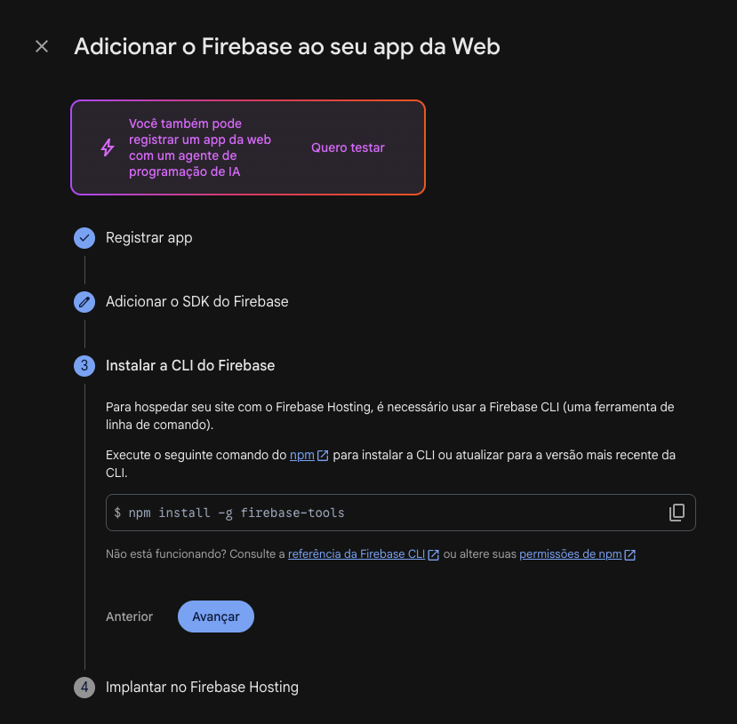

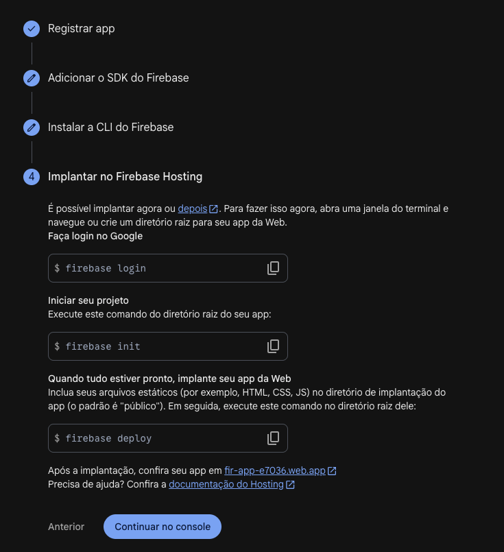

---

## 4. Deploy

Confirm the CLI is installed and authenticated as the account that owns the project:

```sh
firebase --version
firebase login:list     # firebase login, if the list is empty
```

Then, from the repo root:

```sh
npm run build:deploy:firebase
```

That one script chains three steps:

| #   | Step   | Command behind it                                                              |
| --- | ------ | ------------------------------------------------------------------------------ |
| 1   | Build  | `nx build demo-app --configuration=production` → `dist/apps/demo-app/browser/` |
| 2   | Copy   | `npm run utils:copy:dist` → copies `dist/` into `hosting/`                     |
| 3   | Deploy | `npm run deploy:firebase` → `firebase deploy --only hosting` from `hosting/`   |

The copy step exists because `firebase.json` lives in `hosting/` and its `public` path
is resolved relative to that directory.

Success ends with the public URL:

```
✔  Deploy complete!
Hosting URL: https://fir-app-e7036.web.app
```

---

## How the pieces fit

```
project root
├── config/firebase.json                    ← your Firebase object (git-ignored)
│     │
│     └── tools/generate-config.mjs
│           ├──▶ libs/environment/src/lib/generated/firebase.config.ts  (git-ignored) → the app
│           └──▶ hosting/.firebaserc                                    (git-ignored) → the CLI
│
├── dist/apps/demo-app/browser/             ← Angular build output
└── hosting/
    ├── firebase.json                       ← SPA rewrites + cache headers (tracked, do not init over it)
    ├── .firebaserc                         ← generated
    └── dist/                               ← copied at deploy time (git-ignored)
        └── apps/demo-app/browser/
```

`hosting/firebase.json` is already set up for an Angular SPA:

- every route rewrites to `/index.html`, so client-side routing survives a page refresh
- `index.html` is served `no-cache`, so a deploy is visible immediately
- hashed assets (js, css, fonts, images) are cached for a year

Do not change its `public` path unless you also change `outputPath` in
`apps/demo-app/project.json` — the two must match.

---

## Troubleshooting

| Symptom                                          | Cause and fix                                                                                                                                    |
| ------------------------------------------------ | ------------------------------------------------------------------------------------------------------------------------------------------------ |
| `Invalid project id: YOUR_FIREBASE_PROJECT_ID`   | `config/firebase.json` is missing, or its `projectId` is empty. Run `npm run config:generate` and read what it prints.                           |
| `HTTP Error: 403` on deploy                      | Logged in as the wrong account. `firebase login:list`, then `firebase login`.                                                                    |
| Site loads but any deep link 404s                | `firebase.json` lost its rewrites — most likely `firebase init` overwrote it. Restore it from git.                                               |
| Deploy succeeds, but the old build is served     | The build output never reached `hosting/dist/`. Use `npm run build:deploy:firebase` rather than calling `firebase deploy` yourself.              |
| No analytics events in the console               | `measurementId` missing from `config/firebase.json`, or you are on the `local` configuration — it hardcodes `firebaseEnabled: false` on purpose. |
| Edited the config but the running app ignores it | `nx serve` regenerates when it _starts_. Run `npm run config:generate` and the watcher picks it up.                                              |

---

## Adding a second app

See [`../.claude/skills/firebase-deploy/SKILL.md`](../.claude/skills/firebase-deploy/SKILL.md) — it covers
extra hosting targets, CI deploys with GitHub Actions secrets, and the scripts in
detail. Config internals live in [`../config/README.md`](../config/README.md) and
[`../libs/environment/README.md`](../libs/environment/README.md).
